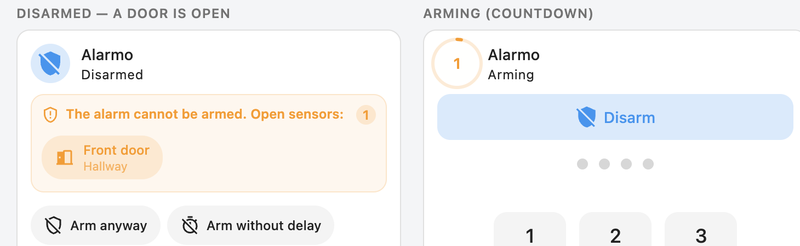
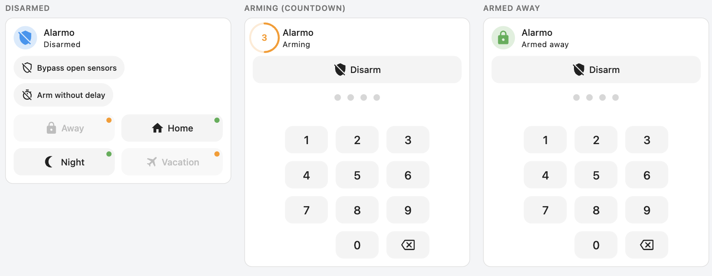
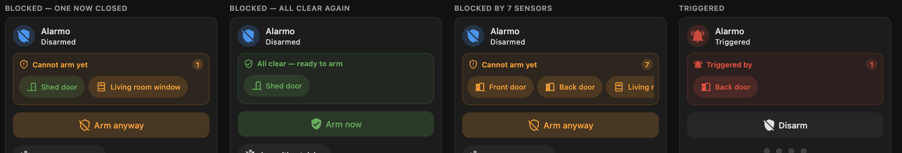

# Alarmo Mushroom Card

A Home Assistant Lovelace card for the [Alarmo](https://github.com/nielsfaber/alarmo)
alarm panel, drawn in the Mushroom design language — with an open-sensor panel you can
actually read.

> **Origin notice** — This is an independent rewrite, not a fork. The Alarmo websocket
> protocol and the YAML configuration surface are reimplemented from
> [nielsfaber/alarmo-card](https://github.com/nielsfaber/alarmo-card) (Apache-2.0) so that an
> existing dashboard keeps working with only the `type:` line changed. The visual system
> reproduces [piitaya/lovelace-mushroom](https://github.com/piitaya/lovelace-mushroom)
> (Apache-2.0). See [NOTICE](NOTICE) for the full attribution.
>
> **Nothing to install alongside it.** The Mushroom primitives are reimplemented inside the
> card. If you *do* have a Mushroom theme installed, the card reads its `--mush-*` tokens and
> follows it.

[](https://my.home-assistant.io/redirect/hacs_repository/?owner=lucasgiovanny&repository=alarmo-mushroom-card&category=dashboard)



[Features](#features) • [Installation](#installation) • [Usage](#usage) • [Options](#options) • [Migrating](#migrating-from-alarmo-card) • [Screenshots](#screenshots) • [Development](#development) • [License](#license)

## Features

- Mushroom's layout, colour formula, control geometry and motion, honoured token for token —
  the card sits beside a Mushroom card without looking almost right
- **A readable open-sensor panel.** Blocking sensors are chips you can scroll, tap to open
  more-info, and watch turn green the moment you shut the door
- The bypass action is **separate from the message**, so `show_messages: false` no longer
  takes away the only way to arm past an open door
- A sensor that closes while the panel is up flips the panel to *All clear — ready to arm*
  and the button to a plain arm — no needless bypass
- Ready-to-arm dots that actually update live, and a not-ready button that cannot be tapped
  into a failed arm
- Countdown ring driven by an absolute deadline, so a backgrounded tab comes back correct
- A keypad with backspace instead of clear-everything, and code dots instead of a text field
  that drags up the on-screen keyboard
- Tapping the card does not open the entity dialog. It does nothing by default, or opens the
  keypad where a code is asked for in a sheet — `tap_action` decides
- The code sheet says what it is about to do — which alarm, which mode, how long the exit
  delay is, and whether anything is being bypassed — before asking for the code
- Mode buttons stay on one row and drop their labels when the words stop fitting, rather than
  wrapping to a second line or squeezing every label into an ellipsis
- `default` / `horizontal` / `vertical` layouts, `fill_container`, and a height the sections
  grid sizes to the card rather than the other way round
- Seven languages — English, Portuguese (BR and PT), Spanish, French, German, Italian —
  following the Home Assistant profile language, with no picker of its own to keep in step
- A visual editor that only offers the settings that can do something: the keypad section
  drops what an overlay or a text code makes meaningless instead of greying it out
- Visual editor covering every state — including `triggered`, `arming` and `pending`, which
  the original editor could not reach at all

## Installation

### HACS (custom repository)

1. HACS → three-dot menu → **Custom repositories**
2. Repository: `https://github.com/lucasgiovanny/alarmo-mushroom-card`, type **Dashboard**
3. Install **Alarmo Mushroom Card**, then reload your browser

### Manual

1. Copy `dist/alarmo-mushroom-card.js` to `config/www/community/alarmo-mushroom-card/`
2. Settings → Dashboards → three-dot menu → **Resources** → **Add resource**:

   ```yaml
   url: /local/community/alarmo-mushroom-card/alarmo-mushroom-card.js
   type: module
   ```

3. Reload your browser with the cache cleared

`scripts/deploy.sh` does the copy over SSH and prints a cache-busted URL:

```bash
HA_HOST=homeassistant.local ./scripts/deploy.sh
```

## Usage

The only required option is the entity:

```yaml
type: custom:alarmo-mushroom-card
entity: alarm_control_panel.alarmo
```

A fuller example:

```yaml
type: custom:alarmo-mushroom-card
entity: alarm_control_panel.alarmo
name: Home
language: auto            # auto | en | pt-br | pt-pt | es | fr | de | it
layout: default           # default | horizontal | vertical
show_bypass_button: true
confirm_bypass: true      # a second tap before arming past an open sensor
max_sensor_chips: 6       # the rest collapse behind "+N more"
states:
  armed_away:
    button_label: Away
    button_icon: mdi:lock
    button_order: 1
  armed_home:
    button_label: Home
    button_order: 2
  armed_night:
    hide: always          # never | always | disarmed | armed
  triggered:
    state_label: Intruder
    color: red
```

More in [`examples/`](examples/).

## Options

### Card

| Option | Type | Default | Description |
|---|---|---|---|
| `entity` | string | **required** | An `alarm_control_panel` entity created by Alarmo |
| `name` | string | friendly name | Title beside the icon. `''` draws no name at all |
| `layout` | string | `default` | `default`, `horizontal`, `vertical` |
| `fill_container` | boolean | `false` | Stretch to fill a grid or stack cell |
| `icon_type` | string | `icon` | `icon` or `none` |
| `tap_action` | string | `code` when `use_code_dialog`, else `none` | What tapping the card body does: `none`, `code` (open the keypad), `more-info` |
| `button_content` | string | `icon_and_name` | What the mode buttons show: `icon_and_name`, `icon`, `name` |
| `button_scale_actions` | number | `1` | 1.0 – 2.5 |
| `button_scale_keypad` | number | `1` | 1.0 – 2.5 |
| `hide_keypad` | boolean | `false` | Keep the code field, drop the digits |
| `keep_keypad_visible` | boolean | `false` | Draw the keypad even when no code is needed |
| `use_code_dialog` | boolean | `false` | Ask for the code in a sheet instead of inline |
| `show_messages` | boolean | `true` | Show which sensors are open |
| `show_bypass_button` | boolean | `true` | Show the bypass action |
| `show_ready_notice` | boolean | `true` | Show the panel once every blocking sensor has closed again |
| `confirm_bypass` | boolean | `true` | Require a second tap before bypassing |
| `show_ready_indicator` | boolean | `true` | Readiness dot on each arm button |
| `show_bypassed_sensors` | boolean | `true` | Show bypassed sensors while armed |
| `show_skip_delay_option` | boolean | `true` | The no-delay shortcut while disarmed |
| `max_sensor_chips` | number | `6` | Chips shown before `+N more` |
| `states` | object | `{}` | Per-state overrides, below |

### `states.<state>`

States: `disarmed`, `arming`, `pending`, `triggered`, `armed_away`, `armed_home`,
`armed_night`, `armed_vacation`, `armed_custom_bypass`.

| Option | Type | Applies to | Description |
|---|---|---|---|
| `state_label` | string | all | Replaces the state text under the name |
| `color` | string | all | A Home Assistant colour name, an `r, g, b` triplet, or any CSS colour |
| `button_label` | string | button states | Replaces the button text. Empty on every button gives an icon-only row |
| `button_icon` | string | button states | Replaces the button icon |
| `button_order` | number | button states | Ascending. A button without one keeps its natural position, so `button_order: 9` on a single mode puts it ninth rather than first |
| `hide` | string \| boolean | button states | `never`, `always`, `disarmed` (hidden while disarmed), `armed` (hidden while armed). `true`/`false` also accepted |

An unknown key under `states` is reported as a config error rather than silently ignored — a
`states.armed_hom` typo is otherwise a very quiet way to lose an afternoon.

## Migrating from alarmo-card

Change one line:

```diff
-type: custom:alarmo-card
+type: custom:alarmo-mushroom-card
```

Every option above is read the same way, including the legacy `button_scale`. Three
behaviours differ on purpose — see [docs/MIGRATING.md](docs/MIGRATING.md).

## Screenshots

States, countdown ring and keypad:



The open-sensor panel in dark mode — blocked, all-clear, many sensors, triggered:



## Development

There is no build step. `dist/alarmo-mushroom-card.js` is the source, hand-written and
committed as-is.

```bash
node --check dist/alarmo-mushroom-card.js
for f in tests/*.test.mjs; do node "$f"; done
```

Two harness pages run against a fake `hass`, so the card can be worked on without a Home
Assistant instance. `docs/harness.html` mounts one card per state with light/dark and
Mushroom-theme toggles; `docs/editor-harness.html` drives the visual editor through a
stand-in for `ha-form` that reproduces Home Assistant's own value-nesting rules.

```bash
python3 -m http.server 8777
open http://127.0.0.1:8777/docs/harness.html
```

## License

Apache-2.0. See [LICENSE](LICENSE) and [NOTICE](NOTICE).

## Trademark notice

"Mushroom" is the name of Paul Bottein's project and "Alarmo" is the name of Niels Faber's
integration. This card is an independent work, not affiliated with or endorsed by either.
Both names are used only to describe what it is compatible with.
